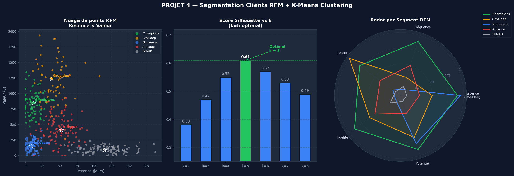

# 🛒 Segmentation Clients RFM — Marketing Data Science


> Segmentation client par la méthode **RFM** (Recency, Frequency, Monetary) et clustering K-Means pour produire des recommandations marketing actionnables.

---


## Visualisation



> *Nuage de points RFM · Score Silhouette (k=5 optimal) · Radar par segment*
## 🎯 Objectif

Transformer 541 000 transactions e-commerce en une segmentation client exploitable par les équipes marketing pour personnaliser les actions CRM et maximiser le ROI.

---

## 📊 Dataset

**UCI Online Retail Dataset** (public)
- 541 909 transactions · 8 colonnes · Royaume-Uni 2010-2011
- Source : [UCI ML Repository](https://archive.ics.uci.edu/dataset/352/online+retail)

---

## 🗂️ Structure

```
segmentation-clients-rfm/
├── notebooks/
│   ├── 01_rfm_analysis.ipynb           # Calcul des scores RFM
│   └── 02_segmentation_recommandations.ipynb  # K-Means + actions marketing
├── data/
│   └── download_data.py                # Script de téléchargement
└── requirements.txt
```

---

## 🔍 Méthodologie

1. **Recency** : jours depuis le dernier achat
2. **Frequency** : nombre de commandes
3. **Monetary** : chiffre d'affaires total
4. **Scoring** : quintiles 1-5 pour chaque dimension
5. **Clustering** : K-Means sur les scores RFM normalisés

---

## 📈 Segments identifiés

| Segment | Description | Action marketing |
|---------|-------------|-----------------|
| 🌟 Champions | Achètent souvent, récemment, dépensent beaucoup | Programme de fidélité VIP |
| 💤 À risque | Bons clients mais inactifs depuis + 60j | Campagne de réactivation |
| 🆕 Nouveaux | Premier achat récent | Onboarding + offre de bienvenue |
| 💰 Gros dépensiers | CA élevé mais peu fréquents | Upsell & cross-sell |
| 👋 Perdus | Inactifs + 90j | Dernière chance discount |

---

## 👤 Auteur

**Harry TEGUE** — Data Analyst · Certified Google Advanced Data Analytics
